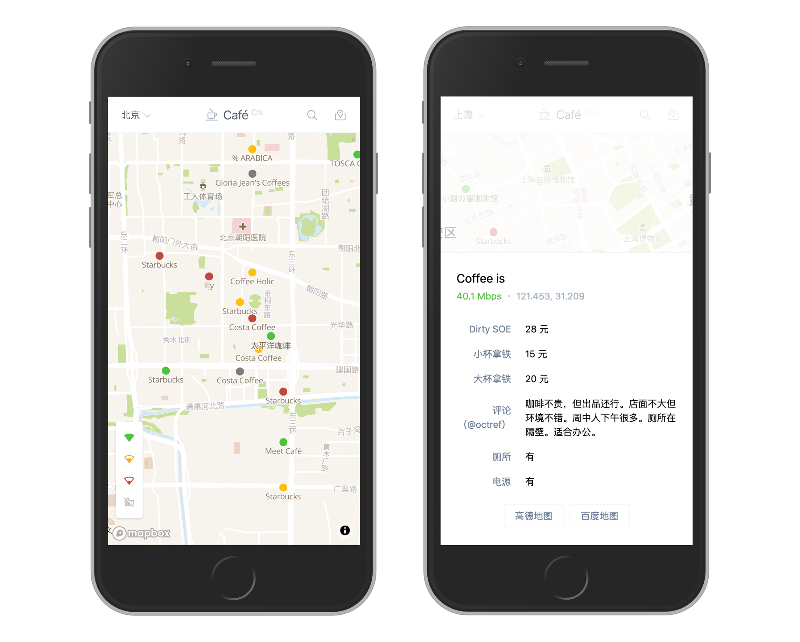

Web App for <a href='https://github.com/ElaWorkshop/awesome-cn-cafe'>Awesome CN Café</a>

<a href='https://cafe-cn.netlify.app'/>👉 Goto App</a>

 

## Features

- Instant searching
- Show my location and distances to shops
- Direct open in map apps
- Filter by network speed
- Filter by refererrs
- Auto sync with the source every day on 00:00 UTC, thanks [@yihong0618](https://github.com/yihong0618)
- Powered by [Vite](https://github.com/vitejs/vite) and [reactivue](https://github.com/antfu/reactivue) (React + Vue)

> 💡 For maintainers of other awesome cafe lists, if you are intersted in maintaining a fork for your cafe list, let me know and I am happy to help :)

## TODO

- Auto PR Generator
  - Leave comments to existing shops
  - Add a new shop right inside app

## License

MIT - Anthony Fu 2020
